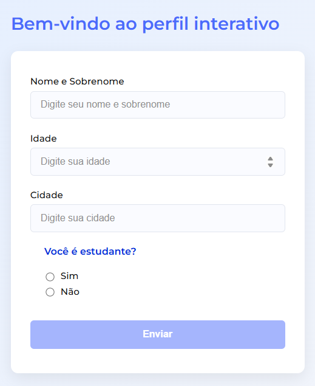
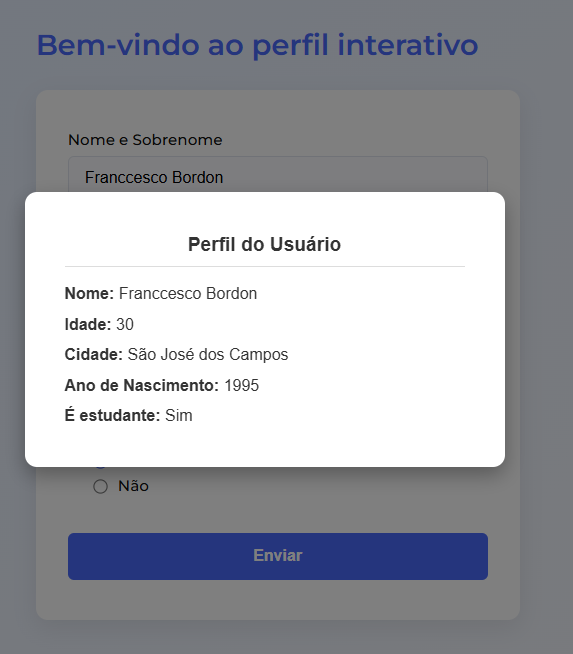

# 🧾 Formulário de Perfil — Angular

Um pequeno projeto em **Angular** que demonstra o uso de formulários reativos, e um modal para apresentar as informações preenchidas pelo usuário.

---

## 🚀 Funcionalidades

- Formulário reativo com validações;
- Exibição dos dados do usuário em um modal ao enviar o formulário;
- Cálculo automático do **ano de nascimento** com base na idade informada;
- Fechamento do modal ao clicar fora da caixa ou pelo botão interno;

---

## 🧱 Estrutura do Projeto
```
src/
├── app/
│ ├── page-one/
│ │ ├── page-one.ts # Lógica principal do formulário e modal
│ │ ├── page-one.html # Estrutura HTML
│ │ └── page-one.scss # Estilos modernos do modal e formulário
│ └── app.module.ts # Configuração do módulo principal
└── main.ts # Ponto de entrada da aplicação
```

---

## 🧩 Tecnologias Utilizadas

- **Angular 18+**
- **TypeScript**
- **Reactive Forms**
- **SCSS**

---

## ⚙️ Como Executar

1. Clone o repositório:
```bash
git clone https://github.com/Tiesco789/perfil-interativo.git
```

Acesse a pasta do projeto:
```bash
cd formulario-perfil-angular
```

Instale as dependências:
```bash
npm install # or pnpm i | npm i | yarn
```

Inicie o servidor de desenvolvimento:
```bash
ng serve
```

Acesse no navegador:
```
http://localhost:4200
```

---

## 🧠 Lógica Principal
- O formulário é construído com FormGroup e FormControl, garantindo reatividade e validações.
- Ao enviar (onSubmit()), os dados do formulário são validados e armazenados em variáveis do componente.
- O modal é exibido com *ngIf="showModal" e mostra os valores preenchidos pelo usuário.
- O ano de nascimento é calculado dinamicamente:
```typescript
this.anoNasc = this.currentYear - Number(this.studentForm.value.age);
```

## 🎨 Estilo do Modal
O modal é centralizado na tela, com fundo semitransparente e transição suave.
Também pode ser fechado ao clicar fora da área principal:

```html
<div *ngIf="showModal" class="modal" (click)="closeModal()">
  <div class="modal-box" (click)="$event.stopPropagation()">
    <!-- Conteúdo do modal -->
  </div>
</div>
```

---

## Prints do projeto



---

## 👨‍💻 Autor
**Franccesco Antonio**

Desenvolvedor Jr | Estudante de tecnologias Front-end (Angular, React)

🏷️ Licença
Este projeto é livre para estudo e modificação.
Sinta-se à vontade para usar como base de aprendizado.
